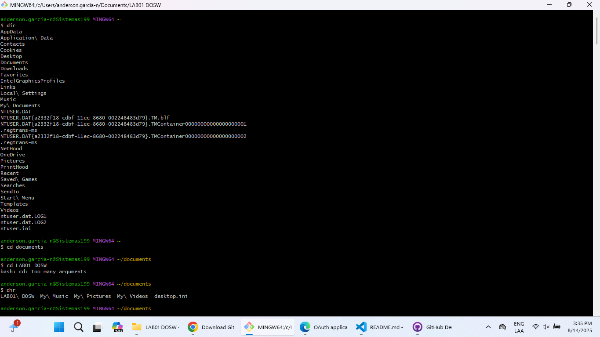

<div align="center">
  
</div>

# 💻 Práctica Git: Comandos Básicos

---

## 👥 Integrantes

| Nombre                                  |
|-----------------------------------------|
| Anderson Fabián García Nieto            |
| Christian Alfonso Romero Martinez       |

---

## 📖 Descripción

Este repositorio contiene la práctica de comandos básicos de Git, incluyendo ejemplos, flujo de trabajo y evidencia fotográfica del proceso realizado tanto en terminal como en GitHub Desktop.

---

## 📌 Respuestas

### 🧠 Pregunta 3
**¿Para qué sirven y cómo se usan los comandos `git add` y `git commit -m "mensaje"`?**

Los comandos `git add` y `git commit -m "mensaje"` son fundamentales en Git. Se utilizan para guardar los cambios realizados en el repositorio local. A continuación se explica su propósito y uso:

---

### 🟢 `git add`

**¿Para qué sirve?**

- Prepara los cambios (archivos nuevos, modificados o eliminados) para ser incluidos en el próximo commit.
- Puedes agregar archivos individuales o todos los cambios a la vez.

**Modos de uso:**

- Agregar un archivo específico:
  ```bash
  git add nombre_archivo.txt
  ```
- Agregar todos los cambios en el directorio actual:
  ```bash
  git add .
  ```
- Agregar solo archivos modificados (no nuevos):
  ```bash
  git add -u
  ```
- Agregar interactivamente (te permite elegir qué cambios incluir):
  ```bash
  git add -p
  ```

---

### 🔵 `git commit -m "mensaje"`

**¿Para qué sirve?**

- Guarda los cambios preparados con `git add` en el historial del repositorio.
- El mensaje (`-m`) debe ser claro y descriptivo, explicando los cambios realizados.

**Cómo se usa:**


```bash
git commit -m "Añade función de login básico"
```

> 💡 Si no usas la opción `-m`, Git abrirá un editor (como Vim o Nano) para que escribas un mensaje más largo.

---

### 🧩 Ejemplo de flujo completo

1. Modificas un archivo (`archivo.txt`).
2. Preparas el cambio con `git add`:
  ```bash
  git add archivo.txt
  ```
3. Confirmas el cambio con `git commit`:
  ```bash
  git commit -m "Corrige error en archivo.txt"
  ```

---

## 🛠️ Resolución de Errores

Durante la colaboración, se presentó el siguiente mensaje de error al intentar hacer push:

```text
Enumerating objects: 5, done.
Counting objects: 100% (5/5), done.
Delta compression using up to 16 threads
Compressing objects: 100% (2/2), done.
Writing objects: 100% (3/3), 393 bytes | 196.00 KiB/s, done.
Total 3 (delta 1), reused 0 (delta 0), pack-reused 0 (from 0)
remote: Resolving deltas: 100% (1/1), completed with 1 local object.
To https://github.com/Anderfg13/LAB01-DOSW.git
 ! [remote rejected] main -> main (cannot lock ref 'refs/heads/main': is at 0ad956f98beb9d5bf3325278c898a566087e5f11 but expected 6edba0e8542aa7cfaaa224e32e4f128765ef0572)
error: failed to push some refs to 'https://github.com/Anderfg13/LAB01-DOSW.git'
```

**Solución aplicada:**

Se resolvió deshaciendo el commit que no fue admitido y repitiendo el proceso correctamente.

---

## 🔄 Mejores Prácticas para Evitar Conflictos en Git

```bash
# Flujo de trabajo recomendado:

1. # Sincroniza con el repositorio principal ANTES de empezar
git pull origin main

2. # Crea una rama nueva para cada funcionalidad/corrección
git checkout -b feat/nombre-de-tu-rama

3. # Haz commits frecuentes y descriptivos
git add .
git commit -m "✨ [feat] Agrega función de cálculo de fracciones"

4. # Mantén tu rama actualizada (sin mezclar commits)
git fetch origin
git rebase origin/main

5. # Sube tus cambios al repositorio remoto
git push -u origin feat/nombre-de-tu-rama

---
# Proceso de Pull Request (PR):

1. Crea tu rama y sube cambios:
git checkout -b feature/nueva-funcion
git push origin feature/nueva-funcion

2. En GitHub:
- Ve a "Pull Requests" > "New Pull Request"
- Selecciona:
  * Base: main (rama destino)
  * Compare: tu-rama (tus cambios)

3. Completa el formulario:
- Título descriptivo (ej: "✨ Añade función de cálculo")
- Descripción detallada:
  * Qué cambiaste
  * Por qué
  * Capturas si es necesario

4. Asigna revisores (tu compañero/profesor)

5. Resuelve comentarios (si los hay):
- Haz nuevos commits en tu rama
- Los cambios se actualizan automáticamente en el PR

6. Merge (cuando sea aprobado):
- Opción "Squash and merge" (combina todos los commits)
- Borra la rama (opción disponible al mergear)

---

## 🚩 Creación de Ramas y Pull Request

Se crearon las ramas `feature/ChristianRomero` y `feature/AndersonGarcia` para la gestión de cambios y la posterior realización de un Pull Request, por cada integrante, para la aceptación y/o rechazo del Pull Request.

---


## 🖼️ Galería de Evidencias

<div align="center">
  
  
  
  
  
  
  
  
  
  
  
  
  
  
  
  
  
</div>

---

<div align="center">
  <sub>Escuela Colombiana de Ingenieria Julio Garavito - Decanatura de Sistemas - DOSW - 2025</sub>
</div>
