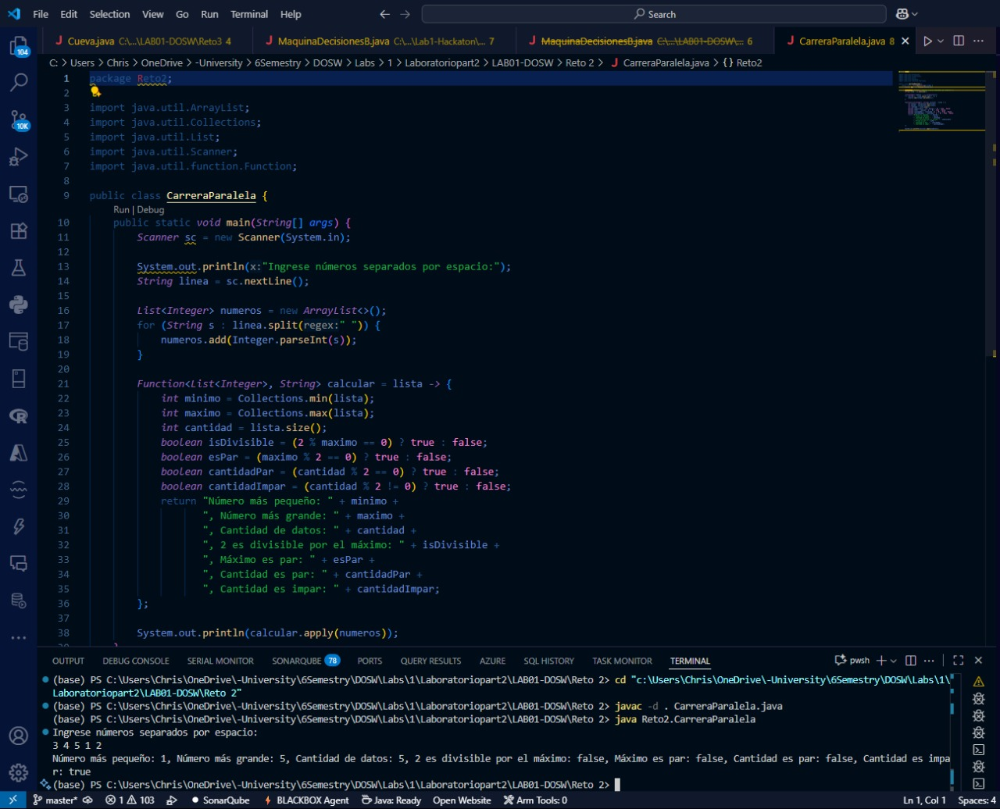

# Carrera Paralela

## Descripción del Proyecto

Este proyecto implementa una aplicación Java que utiliza colecciones (`ArrayList`) y expresiones lambda para analizar una lista de números ingresados por el usuario.

## Funcionalidad Principal

### Clase CarreraParalela

La clase principal contiene la lógica para procesar una lista de números y calcular diferentes propiedades estadísticas y lógicas sobre ellos.

#### 1. Entrada de Datos
- Solicita al usuario ingresar números enteros separados por espacio.
- Convierte la entrada en una lista de enteros (`ArrayList<Integer>`).

#### 2. Procesamiento con Lambda
- Utiliza una expresión lambda (`Function<List<Integer>, String>`) para calcular:
  - Número más pequeño
  - Número más grande
  - Cantidad de datos
  - Si 2 es divisible por el máximo
  - Si el máximo es par
  - Si la cantidad de datos es par o impar

#### 3. Salida de Resultados
- Muestra en consola el resultado del análisis realizado por la lambda.

## Ejecución

### Ejecucion 
<div align="center">
  
</div>


---

**Ejemplo de salida:**
```
Ingrese números separados por espacio:
4 7 10 2
Número más pequeño: 2, Número más grande: 10, Cantidad de datos: 4, 2 es divisible por el máximo: false, Máximo es par: true, Cantidad es.

