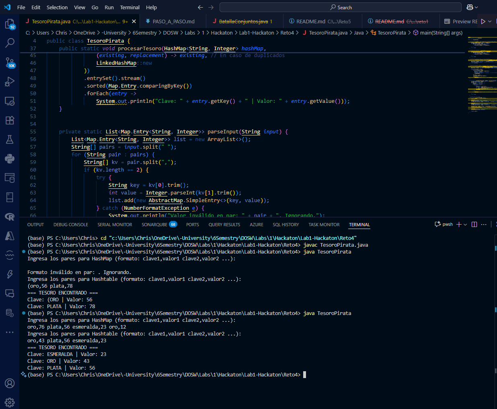

# Tesoro Pirata - Gestión de Mapas

## Descripción del Proyecto

Aplicación Java que simula la gestión de un tesoro pirata utilizando diferentes tipos de mapas (`HashMap` y `Hashtable`) para demostrar sus diferencias y características únicas.

## Problema a Solucionar

Los piratas han encontrado un tesoro y necesitan catalogarlo usando dos métodos diferentes:
- **HashMap**: Rápido pero no thread-safe
- **Hashtable**: Sincronizado y thread-safe
- **Conflicto**: Cuando hay duplicados, Hashtable tiene prioridad

## Funcionalidad Principal

### Métodos Implementados

#### 1. `crearHashMap(List<Map.Entry<String, Integer>> pares)`
- Crea un HashMap ignorando claves duplicadas (conserva primer valor)
- Optimizado para velocidad
- No sincronizado

#### 2. `crearHashtable(List<Map.Entry<String, Integer>> pares)`
- Crea un Hashtable sincronizado
- Thread-safe para entornos concurrentes
- Ignora claves duplicadas

#### 3. `combinarMapas(HashMap, Hashtable)`
- Combina ambos mapas
- **Prioridad**: Hashtable sobrescribe valores de HashMap en conflictos
- Retorna resultado unificado

#### 4. `procesarTesoro(HashMap, Hashtable)`
- **Stream API**: Convierte claves a mayúsculas
- **Ordenamiento**: Ordena alfabéticamente por clave
- **Salida formateada**: Muestra resultado final

## Ejemplo de Uso

  

