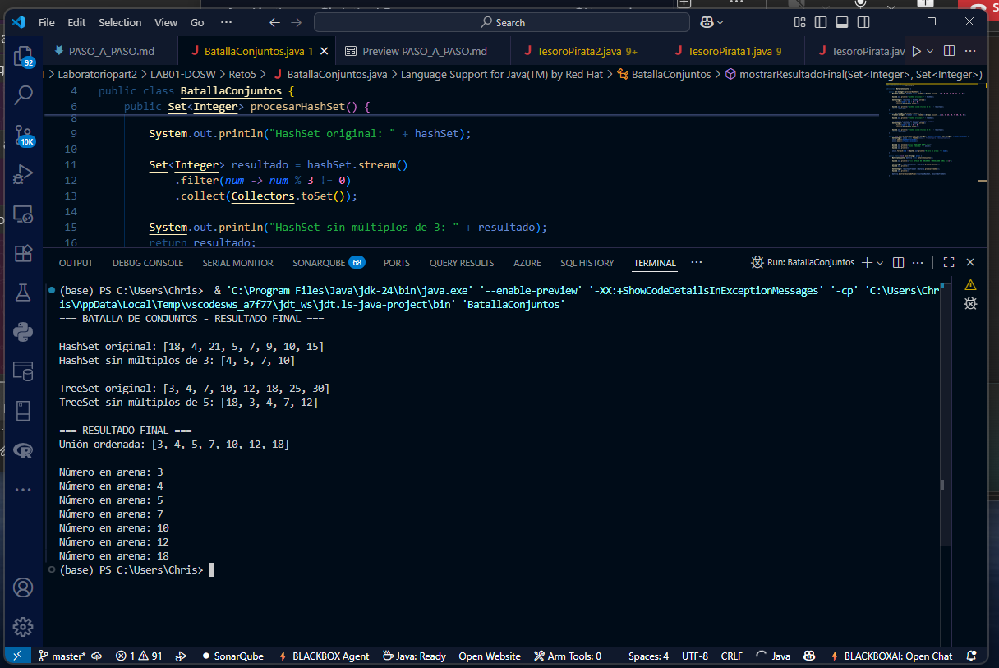

# Batalla de Conjuntos

## Descripción del Proyecto

Este proyecto implementa una aplicación Java que demuestra el uso de diferentes tipos de colecciones (`HashSet` y `TreeSet`) junto con operaciones de Stream API y expresiones lambda.

## Funcionalidad Principal

### Clase BatallaConjuntos

La clase principal contiene tres métodos de procesamiento de datos:

#### 1. procesarHashSet()
- Crea un `HashSet` con números enteros predefinidos
- Utiliza Stream API para filtrar y eliminar múltiplos de 3
- Retorna un conjunto resultante sin orden específico

**Lógica implementada:**
```java
HashSet<Integer> hashSet = new HashSet<>(Arrays.asList(4, 9, 15, 7, 18, 21, 10, 5));
Set<Integer> resultado = hashSet.stream()
    .filter(num -> num % 3 != 0)
    .collect(Collectors.toSet());
```

#### 2. procesarTreeSet()
- Crea un `TreeSet` con números enteros predefinidos
- Utiliza Stream API para filtrar y eliminar múltiplos de 5
- Retorna un conjunto resultante ordenado naturalmente

**Lógica implementada:**
```java
TreeSet<Integer> treeSet = new TreeSet<>(Arrays.asList(12, 3, 25, 10, 7, 30, 18, 4));
Set<Integer> resultado = treeSet.stream()
    .filter(num -> num % 5 != 0)
    .collect(Collectors.toSet());
```

#### 3. mostrarResultadoFinal()
- Combina los resultados de ambos conjuntos procesados
- Crea una unión eliminando duplicados automáticamente
- Utiliza expresión lambda con `forEach()` para mostrar los resultados

**Lógica implementada:**
```java
Set<Integer> union = new TreeSet<>();
union.addAll(hashSetProcesado);
union.addAll(treeSetProcesado);
union.forEach(num -> System.out.println("Número en arena: " + num));
```

### Ejecucion 
<div align="center">
  
</div>
