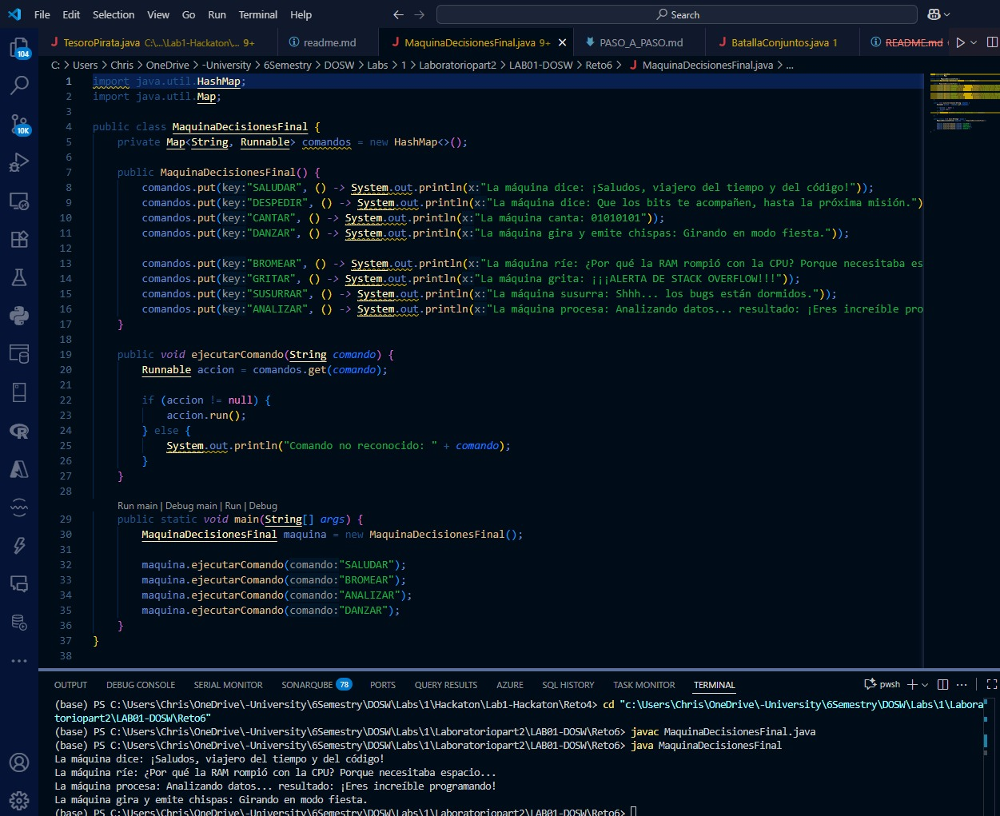

# Maquina Decisiones Final

## Descripción del Proyecto

Este proyecto implementa una aplicación Java que simula una máquina capaz de ejecutar diferentes comandos utilizando expresiones lambda y colecciones (`HashMap`). Cada comando desencadena una acción específica representada por una función.

## Funcionalidad Principal

### Clase MaquinaDecisionesFinal

La clase principal contiene:

- Un `HashMap` que asocia cadenas de texto (comandos) con acciones (`Runnable`).
- Un método para ejecutar el comando solicitado por el usuario.

#### 1. Registro de Comandos
- Los comandos disponibles son: `SALUDAR`, `DESPEDIR`, `CANTAR`, `DANZAR`, `BROMEAR`, `GRITAR`, `SUSURRAR`, `ANALIZAR`.
- Cada comando está vinculado a una acción que se ejecuta mediante una expresión lambda.

#### 2. Ejecución de Comandos
- El método `ejecutarComando(String comando)` busca el comando en el mapa y ejecuta la acción correspondiente.
- Si el comando no existe, muestra un mensaje de error.

#### 3. Ejemplo de Uso
- En el método `main`, se crean instancias de la máquina y se ejecutan varios comandos de ejemplo.

## Ejecución

### Ejecucion 
<div align="center">
  
</div>


---

**Ejemplo de salida:**
```
La máquina dice: ¡Saludos, viajero del tiempo y del código!
La máquina ríe: ¿Por qué la RAM rompió con la CPU? Porque necesitaba espacio...
La máquina procesa: Analizando datos... resultado: ¡Eres increíble programando!
La máquina gira y emite chispas: